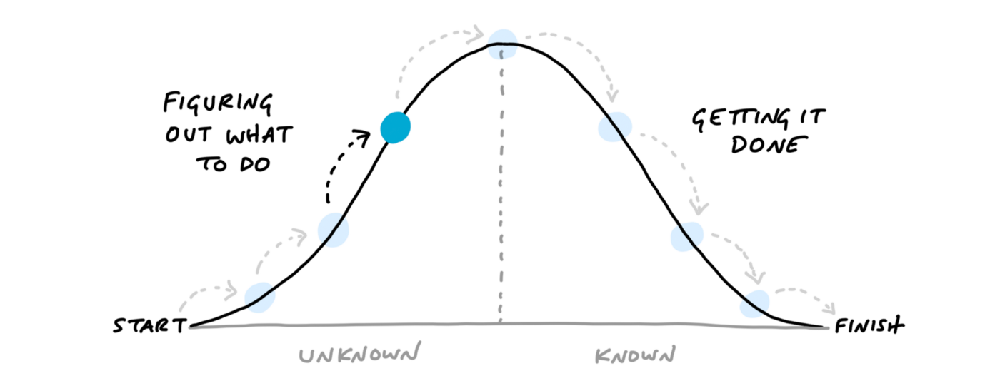
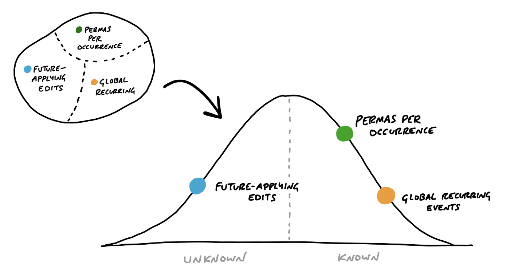
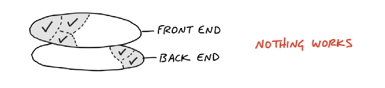
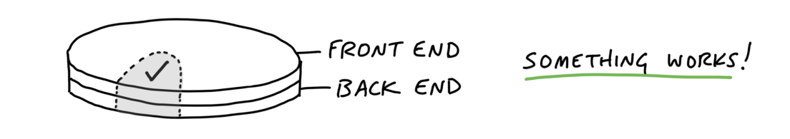

```json
{
  "slug": "shape-up",
  "date": "April 13 2020",
  "title": "Insights from Shape Up for managing projects",
  "summary": "Use the best ideas and tools from Shape Up without having to overhaul your company's entire product development process."
}
```
# Insights from Shape Up for managing projects

[Shape Up](https://basecamp.com/shapeup), the recently released book from Basecamp, gives great insight into how they develop products. But for many
people it won’t be realistic to completely replace the product development process at their work. Luckily the book
contains a lot of great ideas and tools that you can use to build products and manage projects in a better way, without
having to completely overhaul the way you work. 

## What’s Shape Up? 
Shape Up proposes ‘shaping’ a project before starting it, which involves determining how much time you want to spend on
the problem, sketching out a solution, and writing a pitch. 

A cross-functional team consisting of engineers and
designers picks up a pitch and they have six weeks to complete it. The team has complete responsibility and autonomy to
implement the pitch how they see fit. If the project is not done after six weeks, it is not extended. This serves as a
circuit breaker to make sure that you don’t spend a multiple of the time that you wanted to spend on the project.

There is much more to Shape Up. It involves a betting process to determine which pitch to work on; tools like
breadboarding and fat marker sketching; ways to break your project up into scopes, and numerous other things. If you
want to understand the full Shape Up process I would really recommend reading the book, which is excellently written,
short, and free. But for the purposes of this post you don’t need to know all the intricacies of Shape Up. Let’s go over
some great tools and ideas from Shape Up that you can apply immediately to become better at project management. 

## Solve the problem before starting the project 
Every project starts with a problem. Shape Up proposes that you solve the problem before starting the project.
Initially, that seemed counterintuitive to me. Surely you solve the problem during the project? But starting a project
for an unsolved problem leaves large areas of uncertainty. Those areas of uncertainty can prove difficult to solve,
which could delay your project.

For example, you might be building a payment processor. It’s important that every
payment happens only once, to prevent users from being charged twice. You do some research and find that you have to
make the system idempotent to prevent double charging. You’re not exactly sure how to do that, but you write a ticket
saying “add idempotency” and you go ahead with the project. Making the system idempotent turns out to be a hard problem
to solve, and the team spends much more time on it than budgeted for. The project isn’t finished after six weeks, which
in Shape Up terms means that the project is canceled.

This example shows that leaving a large area of uncertainty before starting a project adds a substantial risk that the
project won’t succeed. Shape Up proposes to reduce this risk by figuring out a high level solution to your problem up
front. In the given example that might mean writing a technical proposal while shaping the project about how your system
will provide idempotency.

By working out the high-level solution up front, you might even find that it is not worth it to go ahead with the
project in its current state. You might find that making your payments processor idempotent will be too complex and
you’d rather buy than build.

## Show progress using hill diagrams
One of my favourite ideas from Shape Up is that you can represent the progress of a project by placing each subproblem
of the project on a hill diagram. Shape Up calls these subproblems ‘scopes’, but you might know them as ‘epics’ or
‘features’. I’ll call them scopes to stick with Shape Up’s vocabulary. In our payment processor example, the scopes
might be ‘Pay’ and ‘Refund’.

<figure class="image">
  
  <figcaption>Source: <a href="https://basecamp.com/shapeup/3.4-chapter-12">Shape Up</a></figcaption>
</figure>

Often, when you start working on a scope, you don’t know exactly which tasks you’ll have to complete to finish the
scope. By working on the scope you start to uncover more tasks and you develop an understanding of what the problem
space of the scope looks like. As you build understanding, the scope climbs the left side of the hill. Once you know
exactly what to do to finish the scope, it has reached the top of the hill. Then, you walk the scope down the hill by
finishing all the tasks that you discovered.

<figure class="image">
  
  <figcaption>Source: <a href="https://basecamp.com/shapeup/3.4-chapter-12">Shape Up</a></figcaption>
</figure>

You can represent the status of your project by placing all of its scopes on a single hill diagram. What I love about
this idea is that it can instantly give any stakeholder an overview of how the project is doing. Seeing a scope on a
hill diagram is much more useful than hearing that an epic is e.g. 60% done. Is the remaining 40% just implementation?
Or are there still large unknowns left that can delay the project?
 
## Build in thin slices
Shape Up thinks of project as layer cakes. For example, a software project might have two layers: Front End and Back
End. In many of the projects I’ve worked on, Front End and Back End developers start working on tasks independently and
combine the result of their work later. That’s great because it parallelises their work. However, this also introduces
risk, because the layers might not match up.

<figure class="image">
  
  
  <figcaption>Source: <a href="https://basecamp.com/shapeup/3.2-chapter-10">Shape Up</a></figcaption>
</figure>

If Front End and Back End developers don’t work on the same slice of the layer cake, they might get a lot of tasks done,
but you don’t have anything to show for it. The further you push back the moment that you combine the layers, the later
you will be able to validate your work and get user feedback.
 
You can validate your work much earlier and more often by building in thin slices. That way you can get working features
into the hands of stakeholders and users much earlier, which will allow you to end up with a better product. It also
reduces the risk of the project, because you take away uncertainty about how different layers of the system will fit
together. 

You can find a similar concept of working in thin slices in [User Story Mapping](https://plan.io/blog/user-story-mapping/#step-7-slice-groups-of-tasks-into-iterations).

## Set a fixed timeline, reduce scope 

In Shape Up large projects always last six weeks. Smaller projects are batched into a larger six-week project. If the
team can’t finish the project in time, it is by default not extended. The project deadline is only extended in
exceptional cases, when all of the project’s epics are on their way down the hill, and there’s a high likelihood that
the project can be finished in two weeks.

This stands in contrast to the majority of the software projects that I’ve worked on. They often didn’t have a fixed
timeline, and sometimes went on for a multiple of what was initially budgeted for. Working on a constantly overrunning
project can be a real drain on morale, because it feels like you’re not getting anything done.

Shape Up’s solution to this is to set a fixed timeline for your project, and reduce scope whenever you can to make sure
that you meet your self-imposed deadline. The underlying idea is that it’s better to ship something that’s imperfect,
than to not ship anything at all. It also keeps you focused on the core problem that you’re solving, and it prevents you
from getting lost in scope creep. You don’t have to stick to Shape Up’s six weeks — just set a fixed deadline that works
for your team, and reduce scope where necessary.

## Find what works well for your team 

Shape Up was developed over the course of 15 years at Basecamp, by experimenting and finding out what works well for
them. Rather than subscribing completely to Scrum or to Shape Up, why not iterate on your product development process
like Basecamp has?

Give project shaping, hill diagrams, thin slices and fixed timelines a try. See how they impact you and your team. Keep
what works, and adapt the tools to your needs.